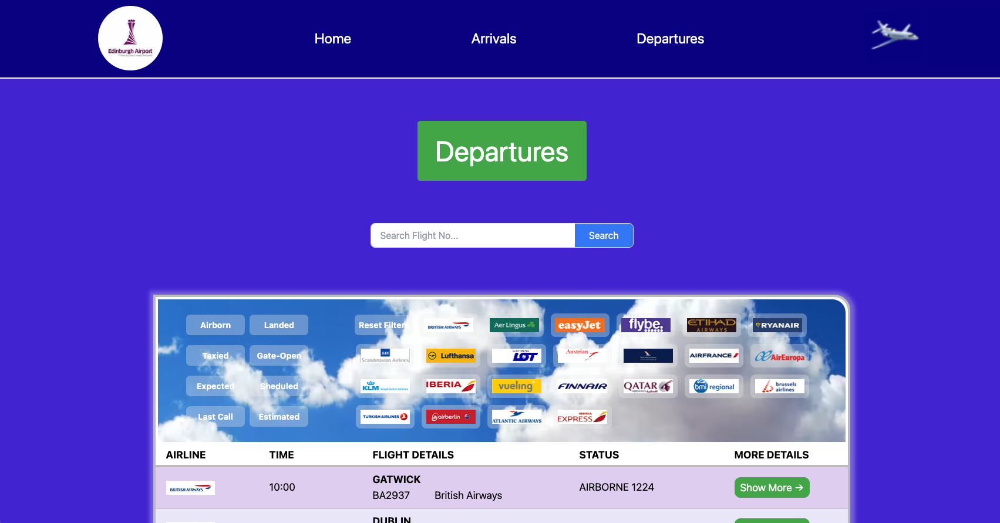

# Edinburgh Airport FlightBoard App (NextJS + NodeJS)


[](https://youtu.be/ZG59H_fwwNk)


### Brief

The client has asked me to build a full stack application using NextJS and Node.js to allow a user to view and filter a list of flight data. Using JSON flight data, create an RESTfull API using Node.js, Express and MySQL.  Then, build a NextJS v13 Frontend, learning new features of the latest version to call the API and that allows a user to see, filter, sort and search Arrivals and Departures.

### MVP

- A user should be able to view a list of all flights
- A user should be able to view a list of all flight arrivals 
- A user should be able to view a list of all flight departures
- A user should be able to view more details of a single flight.
- A user should be able to sort their view of flights, arrivals and departures based on time, flight status and portOfCallA.
- A user should be able to search for a flight using flight number.
- Errors should be caught and handled.

### Extensions

- The frontend and backend should be designed so that it can be scaled if it were a production service. Consider component hierarchy in the NextJS App and the API routing structure. 
- Handling date formatting in the server and frontend from the JSON are strings in DD/MM/YYYY format.

### Advanced Extensions (Not yet achieved)
- Deploy this app of Vercel
- Add rate limiting to improve performance. 
- Implement Redux to better manage state.

<br><br>

# Learnings

##### NextJS v3 migrations to the app folder
- Before this project I had been building in NextJS v12 where I wanted to learn the current v13 changes.  Using the NextJS official docs I learned how to migrate to and use the app folder, NextJS Router and static and dynamic rendering and how to handle state where getStaticProps and other NextJS functionality is now not available in in the app folder.

##### MySQL in Node.js
- Using MySQL and implementing a relational database into a Node backend. I have used relational databases extensively in Django, Flask and Spring but have only used non-relational databases like MongoDB in a node backend.

##### Selecting appropriate SQL fields
- Finding right SQL fields - Varchar(10), Date and Time over DATETIME and formatting these. 

##### Testing with CHAI
- Chai is a testing library for Node.js that allows you to test calls made to the server and test the response to ensure your API routes are functioning correctly. I have used Mocha, React-Testing-Library and Cypress testing before but had never had the chance to use Chai until this project.  I had been using Insomnia, Postman to test API routes up to now but it's nice to have some in-built testing.

##### API security
- I researched how to implement safeguards against SQL injection attacks in Node.js and MySQL.  I leaned how to use prepared SQL statements in Node.js using `?` and added input validation in the controller. 

##### Scalability
- I Implemented a reusable router in the server providing `RESTful` routing. This allows the server to handle routing for any future tables that get added to the database and with only a few lines of code we can reuse the same router. The unused routes are commented out currently to secure the API from being manipulated.
- I used a well-constructed `component hierarchy structure` on the NextJS App.  This allows the app to be extended and maintained with relative ease.


<br><br>

# SETUP + INSTALLATION

### 1 Git clone this repo locally
- In terminal
    ```sh 
        #terminal 
        git clone git@github.com:sjohns2020/AirportX_App.git
    ```
<br>

### 2 Setup the Database 
- Check you have MySQL installed
  ```sh 
        #terminal 
        mysql -V
    ```
- If it’s not installed
    - Installation instructions can be found [here](https://dev.mysql.com/doc/mysql-installation-excerpt/5.7/en/installing.html)
    - Mac - install with [Homebrew]()
- Create the database locally
    -   Enter the MySQL shell
        ```sh 
            #terminal
            mysql -u <your_username> -p 
        ```
    -   Create the flights Database
        ```sql 
            --MySQL shell
            CREATE DATABASE flights;

            SHOW DATABASES;

            EXIT;
        ```
    - In the server create a database config file
        - Create a folder inside the server folder called config and create a file inside config called db.config.js
            ```sh 
                #terminal 
                cd server

                touch config/db.config.js
            ```
        - Drop this code in to db.config.js and add your MySQL username and password
            ```js
            // server/config/db.config.js
            module.exports = {
            HOST: "localhost",
            USER: "ENTER YOUR MYSQL USERNAME - this is 'root' as default",
            PASSWORD: "ENTER YOUR MYSQL PASSWORD",
            DB: "flights"
            };
            ```
<br>

### 3 Start the Server
- Run the seeds file 
    ```sh 
        #terminal 
        cd server
    
        npm i

        npm run seeds

        npm run server:dev
    ```
- (Optional) Run Mocha and Chai tests to ensure the Flight model and API routes are working
    ```sh 
        #terminal
        npm run tests
    ```
- Run the server 
    ```sh 
        #terminal
        npm run server:dev
    ```
- View the backend Node API in the [browser](http://localhost:8080/api/flights)


<br>

### 4 Start the Client (React)
- Run React App
    ```sh 
        #terminal
        cd airport

        npm i

        npm run dev
    ```
- View the frontend NextJS app in the [browser](http://localhost:3000/)


<br><br>

# Flight API Documentation

There is no authentication for the Flight API

| Route | Endpoint | Description |
|-----------------|-----------------|-----------------|
| Find All Flights   | http://localhost:8080/api/flights  | Returns all Flights, can also return a filtered list using one or multiple Query Parameters, e.g. /api/flights[?airline=british&arrHall=domestic](http://localhost:8080/api/flights?airline=british&arrHall=domestic) |
| Find All Arrivals   | http://localhost:8080/api/flights/arrivals   | Returns all Arrival Flights, can also return a filtered list using one or multiple Query Parameters, e.g. flights/arrivals[?airline=british&arrHall=domestic](http://localhost:8080/api/flights/arrivals?airline=british&arrHall=domestic)   |
| Find All Departures   | http://localhost:8080/api/flights/departures   | Returns all Departure Flights, can also return a filtered list using one or multiple Query Parameters, e.g. flights/departures[?airline=british&arrHall=domestic](http://localhost:8080/api/flights/departures?airline=british&arrHall=domestic)    |
| Find Flight by FlightNo   | http://localhost:8080/api/flights/BA8926  | Returns one Flight  |
| Create Flight  | http://localhost:8080/api/flights  | Allows user to add a new flight  |
| Update Flight  | http://localhost:8080/api/flights/EI3672  | Allows user to update a Flight  |
| Delete One  | http://localhost:8080/api/flights/AF1686  | Allows user to delete a Flight   |
| Delete All  | http://localhost:8080/api/flights  | Allows user to delete all Flights  |


<br><br>

# My Process
- Relearned `MySQL` and installed it
- Built a test app to practice implementing MySQL into a node.js backend
    - Built the server to use Express, handle CORS and to run on port 8080.
    - Built the MySQL database and configured it.
    - Built the Flight constructor. 
    - Built methods on the Flight constructor (models/flights.model.js) to handle the CRUD functionality to handle:
        - Creating a flight and inserting it into the flights table in the flights database
        - Getting one flight from the flights table.
        - Getting all flights from the flights table.
        - Update a flight object in the flights table.
        - Deleting one flight from the flight table.
        - Deleting all flights from the flights table. 
    - Created a seeds_data.js file to:
        - hold flight JSON data 
        - Create flights table in the flights database
        - Creating flight objects from our JSON data and saving flight objects to the flights table in our database.
    - Created a reusable router.js file to handle endpoints for our app.  All restful routes and 2 custom routes: 
        - to get back all departing flights
        - to get back all arriving flights
    - Created a flight controller to handle the requests and responses from the client.
    - TESTING - Used Insomnia and MySQL workbench to test all created endpoints were working before building the frontend. 
- Used what I learned from building the test app to create the server for AiportX_app but refactored the Flight constructor to handle the full JSON data.
- TESTING - Added Mocha testing suite to unit test the Flight model
- TESTING - Added Chai testing suite to test requests to the API.
- Added validation to controller and implemented prepared statements to protect against SQL injection attacks.
- Fully tested the API was working
- Create `component hierarchy` and `component structure` diagrams and wireframes to ensure I had a plan for the NextJS App
- Build the NextJS app, refactoring code where needed. 

